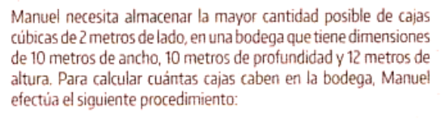
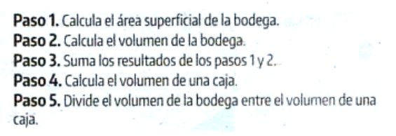
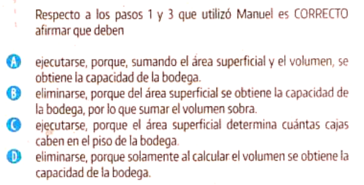

---
output:
  word_document: default
  html_document: default
  pdf_document: default
---

# ISBN: 978-958-5153-36-3-G11-2024-1 Pregunta 13

\

\

\

\

# Capacidad de Almacenamiento.

Para resolver la pregunta presentada, primero necesitamos comprender qué es lo que Manuel quiere calcular y qué procedimientos ha utilizado. Manuel necesita saber cuántas cajas cúbicas de 2 metros de lado puede almacenar en una bodega de 10 metros de ancho, 10 metros de profundidad y 12 metros de altura. Los pasos que siguió están relacionados con el cálculo de áreas y volúmenes.

Vamos a calcular el volumen de la bodega y el volumen de una caja para determinar cuántas cajas caben en la bodega.

### Solución completa
**Paso 1**
Calcular el área superficial de la bodega. No es necesario para este problema, ya que estamos interesados en el volumen.

**Paso 2**
Calcular el volumen de la bodega, que es el ancho por la profundidad por la altura.

**Paso 3**
Sumar los resultados de los pasos 1 y 2 no es un paso necesario, ya que el área superficial no aporta a la capacidad volumétrica para cajas cúbicas.

**Paso 4**
Calcular el volumen de una caja, que es el lado al cubo, es decir, \( 2 m \times 2 m \times 2 m \).

**Paso 5**
Dividir el volumen de la bodega entre el volumen de una caja para obtener cuántas cajas caben.

Vamos a calcular el volumen de la bodega y el de una caja para responder cuántas cajas caben.

**Cálculo del volumen de la bodega:**
\[ V_{bodega} = 10 m \times 10 m \times 12 m \]

**Cálculo del volumen de una caja:**
\[ V_{caja} = 2 m \times 2 m \times 2 m \]

**Cantidad de cajas que caben:**
\[ \text{Cajas} = \frac{V_{bodega}}{V_{caja}} \]

Voy a realizar los cálculos ahora.

**Paso 2**
Calculamos el volumen de la bodega:
\[ V_{bodega} = 10 m \times 10 m \times 12 m = 1200 m^3 \]

**Paso 4**
Calculamos el volumen de una caja:
\[ V_{caja} = 2 m \times 2 m \times 2 m = 8 m^3 \]

**Paso 5**
Dividimos el volumen de la bodega entre el volumen de una caja para obtener cuántas cajas caben:
\[ \text{Cajas} = \frac{V_{bodega}}{V_{caja}} = \frac{1200 m^3}{8 m^3} = 150 \]

**Respuesta Final**

Caben 150 cajas de 2 metros de lado en la bodega.

### Concepto clave
El concepto clave aquí es el **volumen de prismas**, que se calcula como el producto de sus dimensiones lineales. En este caso, la bodega es un prisma rectangular (o paralelepípedo) y las cajas son cubos, ambos son casos especiales de prismas.

### Conceptos y ejemplos relacionados
1. Área superficial: Es la suma total de las áreas de todas las caras de un prisma.
2. Volumen de un cilindro: Se calcula como el área de la base (círculo) multiplicada por la altura del cilindro.
3. Unidades de volumen: Los volúmenes se miden en unidades cúbicas, como \( m^3 \), \( cm^3 \), etc.

En cuanto a la opción correcta respecto a los pasos 1 y 3 que utilizó Manuel, la respuesta correcta es:

**D) eliminarse, porque solamente al calcular el volumen se obtiene la capacidad de la bodega.**

Esto se debe a que la capacidad de almacenamiento en términos de cajas cúbicas depende únicamente del volumen de la bodega, y no de su área superficial. La suma del área superficial y el volumen no proporciona información relevante para determinar la cantidad de cajas que pueden caber en la bodega.

### Retroalimentación Saber ICFES

Para analizar el escenario matemático proporcionado y proporcionar retroalimentación sobre la pregunta tipo Saber ICFES, utilizaré la información proporcionada por los documentos y la estructura del Marco de Referencia - Matemáticas Saber 3°, 5°, 9° y los Estándares Básicos de Competencias en Matemáticas. Veamos paso a paso la pregunta.

El problema presentado se trata de un escenario práctico donde Manuel debe calcular el número de cajas cúbicas que caben en una bodega. Para ello, sigue una serie de pasos que incluyen el cálculo del área superficial y el volumen de la bodega, sumar estos resultados, calcular el volumen de una caja y dividir el volumen de la bodega entre el volumen de una caja.

**Nivel de Desempeño**: Basándome en la descripción de los niveles de desempeño proporcionados, la pregunta parece estar dirigida a estudiantes que se encuentran en un nivel intermedio, posiblemente Nivel 3, ya que requiere de habilidades como realizar operaciones aritméticas básicas y comprender las propiedades de los objetos tridimensionales.

**Competencia**: Esta pregunta evalúa la competencia de **Argumentación**, ya que el estudiante debe justificar y aplicar un procedimiento matemático para resolver un problema concreto de dimensionamiento y capacidad.

**Aprendizaje y Evidencias**: El aprendizaje se enfoca en la capacidad para aplicar conceptos geométricos y aritméticos en situaciones prácticas. La evidencia de aprendizaje se demuestra mediante la correcta ejecución de un plan de solución y la resolución efectiva del problema presentado.

**Tipos de pensamiento**: Se evalúa el **pensamiento espacial-métrico** ya que el estudiante debe entender y aplicar conceptos de volumen y dimensiones espaciales.

**Componente**: El dominio de prueba es la **Geometría**, específicamente el entendimiento y cálculo de volúmenes de figuras tridimensionales.

**Estándar Asociado**: Se relaciona con el estándar que espera que los estudiantes utilicen unidades de medida y realicen cálculos de volumen y área en situaciones prácticas.

**Categoría**: Pertenece a la categoría de **No genéricos**, considerando que el manejo de volumen es un contenido específico del quehacer matemático.

**Situaciones o contexto**: El contexto es **familiar o personal**, relacionado con la gestión del hogar o la organización de un espacio.

**Eje Axial Disciplinar**: Pertenece al eje de **Sólidos Desplegados y Plegados**, al requerir la visualización y cálculo de objetos tridimensionales.

**¿Qué evalúa?**: Evalúa la capacidad de aplicar conocimientos geométricos para resolver problemas prácticos de organización espacial y cálculo de capacidad.

**Respuesta correcta**: La respuesta correcta sería **D**, ya que el área superficial no determina la capacidad de almacenamiento de la bodega. Lo que importa es el volumen de la bodega y el volumen de cada caja para determinar cuántas cajas caben dentro.

**Justificación de la respuesta correcta**: Al calcular el volumen de la bodega y dividirlo por el volumen de una caja, Manuel obtendrá la cantidad máxima de cajas que pueden almacenarse. La suma del área superficial no aporta a este cálculo y por lo tanto, los pasos 1 y 3 deberían eliminarse.

**Motivos que llevan a escoger cada una de las opciones incorrectas**:

- **A**: Podría parecer que sumar área y volumen daría una idea de capacidad, pero conceptualmente son medidas de diferentes propiedades y no pueden sumarse directamente.
- **B**: El área superficial es relevante para el revestimiento o la pintura de la bodega, no para el almacenamiento.
- **C**: El área superficial podría considerarse erróneamente relevante si se piensa solo en el piso de la bodega, pero no toma en cuenta la altura.

**Desde qué nivel (grado) de enseñanza se puede aplicar este ejercicio**:

 Este tipo de ejercicio se podría aplicar desde el nivel de educación primaria superior, donde los estudiantes ya tienen conocimientos de cálculo de área y volumen, pero se desarrolla y consolida en niveles superiores, como la educación secundaria.
